# examPortalSpringBoot
exam portal  using  springboot angular java
Page |  PAGE   \\* MERGEFORMAT **2**

2021

Vaibhav Agarwal

EXAM DOJO

Portal for Examinations

# Contents
` `TOC \o "1-3" \h \z \u [About the Software	 PAGEREF _Toc84613211 \h 2](#_Toc84613211)

[Software Design	 PAGEREF _Toc84613212 \h 2](#_Toc84613212)

[Software Optimizations	 PAGEREF _Toc84613213 \h 2](#_Toc84613213)

[Software Diagrams	 PAGEREF _Toc84613214 \h 3](#_Toc84613214)

[Flow of Control	 PAGEREF _Toc84613215 \h 3](#_Toc84613215)

[Entity Relationship Diagram	 PAGEREF _Toc84613216 \h 3](#_Toc84613216)

[Database Design	 PAGEREF _Toc84613217 \h 4](#_Toc84613217)

[Relationships Among Table within Database	 PAGEREF _Toc84613218 \h 7](#_Toc84613218)

[Demonstration Images of the Software	 PAGEREF _Toc84613219 \h 8](#_Toc84613219)

[Admin Profile	 PAGEREF _Toc84613220 \h 8](#_Toc84613220)

[Registration Page	 PAGEREF _Toc84613221 \h 8](#_Toc84613221)

[Login Page	 PAGEREF _Toc84613222 \h 9](#_Toc84613222)

[Welcome Page of Admin-Side	 PAGEREF _Toc84613223 \h 10](#_Toc84613223)

[Viewing Your Profile Details	 PAGEREF _Toc84613224 \h 11](#_Toc84613224)

[Adding a Subject	 PAGEREF _Toc84613225 \h 12](#_Toc84613225)

[Viewing Created Subjects	 PAGEREF _Toc84613226 \h 14](#_Toc84613226)

[Deleting a Created Subject	 PAGEREF _Toc84613227 \h 15](#_Toc84613227)

[Adding a Quiz	 PAGEREF _Toc84613228 \h 17](#_Toc84613228)

[Adding Questions to a Quiz	 PAGEREF _Toc84613229 \h 19](#_Toc84613229)

[Viewing Created Quizzes	 PAGEREF _Toc84613230 \h 22](#_Toc84613230)

[Updating Quiz Information	 PAGEREF _Toc84613231 \h 23](#_Toc84613231)

[Viewing the Result for a Quiz as a Professor	 PAGEREF _Toc84613232 \h 24](#_Toc84613232)

[Student Profile	 PAGEREF _Toc84613233 \h 25](#_Toc84613233)

[View All Quizzes	 PAGEREF _Toc84613234 \h 25](#_Toc84613234)

[View Quizzes of a Particular Subject	 PAGEREF _Toc84613235 \h 26](#_Toc84613235)

[Starting a Quiz	 PAGEREF _Toc84613236 \h 27](#_Toc84613236)

[Viewing the Result for a Quiz	 PAGEREF _Toc84613237 \h 29](#_Toc84613237)

# About the Software

Exam Dojo is a software that provides professors a user-friendly platform to host quizzes for all of their courses while ensuring that these quizzes are answered by students in an ethical manner.

There are 2 types of profiles that are available in Exam Dojo

- Admin – to be used by the Professor
- Student

Users working on the Admin Profile have the following functionalities available to them:

- Create Courses
- Modify Courses
- Delete Courses
- Create Quizzes
- Modify Quizzes
- Delete Quizzes
- Enable Tab Switch Prevention
- Create Questions
- View Student-Wise Test Results

Users working on the Student Profile have the following functionalities available to them:

- Attempt Quizzes
- Review Quizzes
# Software Design

This software was developed using

- Angular – Frontend
- SpringBoot – Backend
- MySQL – Database Management
## Software Optimizations
- Authentication is quick and secure with JWT Authentication
- Use of Single Webpages ensures faster load times
- Use of a widely-used open-source editor results in the ability for the professor to add questions of various media types, enhancing the breadth of usability of the software and ensuring wider inclusivity
- Usage of automatic submission benefits both profiles of users as work is always saved

# Software Diagrams

## Flow of Control

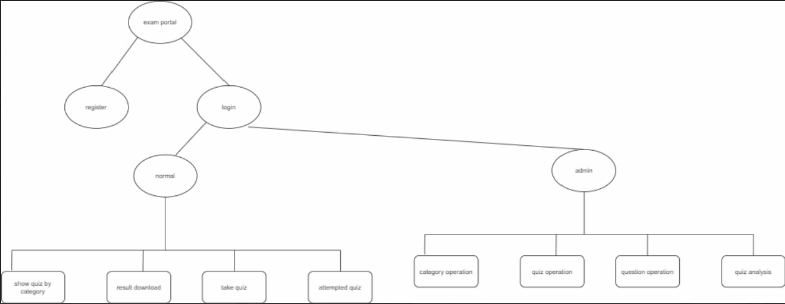

## Entity Relationship Diagram

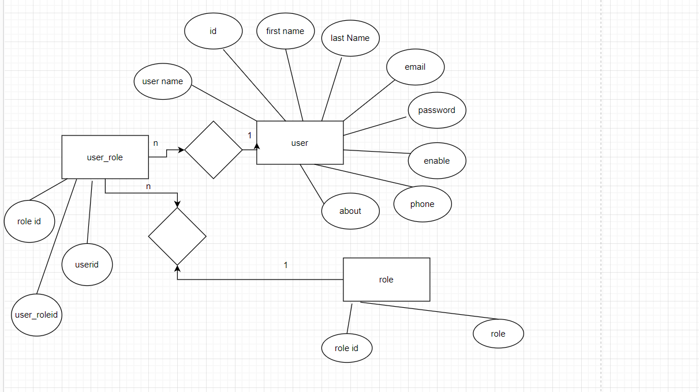
# Database Design

Tables in Database

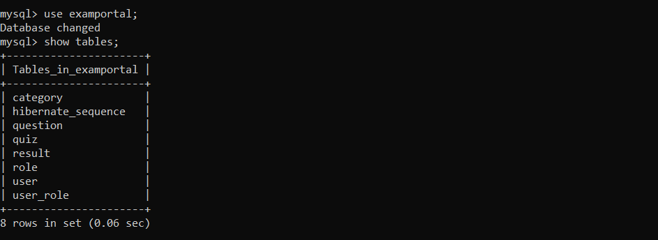

Table - User

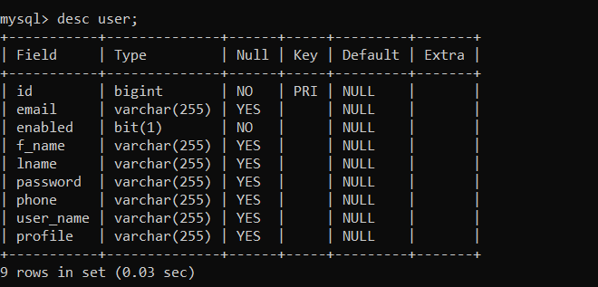

Table - Role

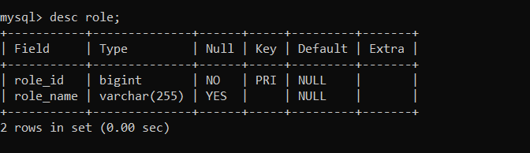

Table - User\_Role

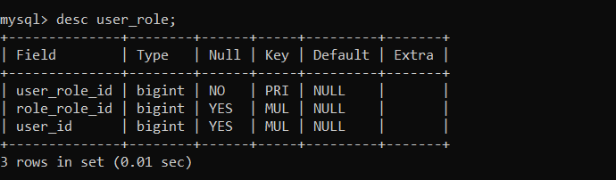

Table - Category

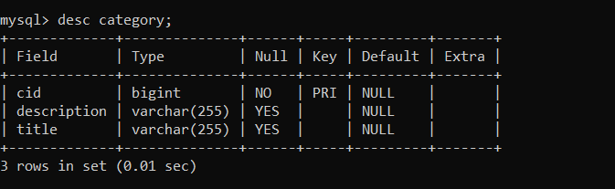

Table - Quiz

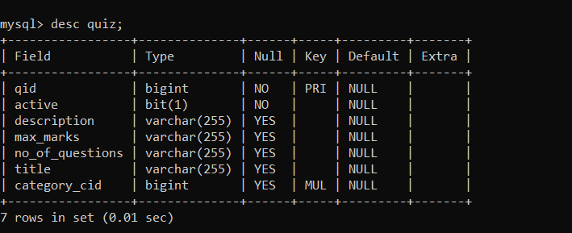

Table - Question

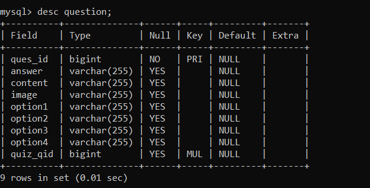

Table - Result

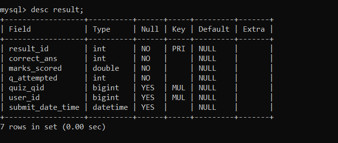

## Relationships Among Table within Database

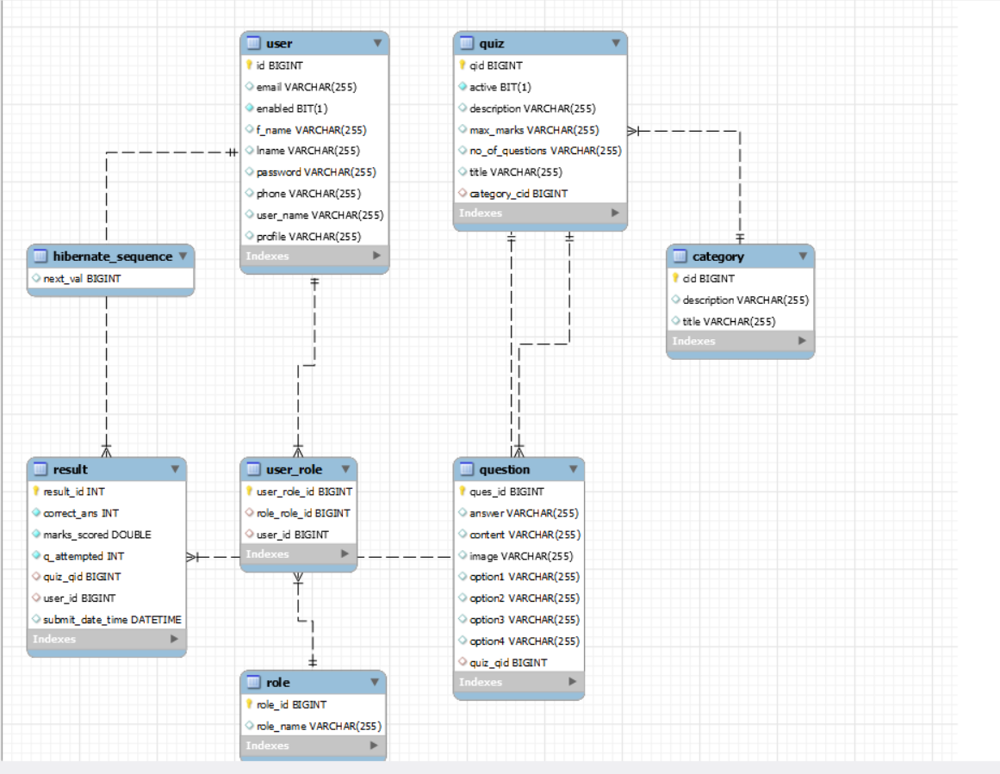

# Demonstration Images of the Software

## Admin Profile

### Registration Page
- Users: All who are not registered with Exam Dojo
- Users are required to enter a valid:
  - Username
  - Password
  - First Name
  - Last Name
  - Email
  - Phone Number
- All entries are validated and appropriate errors will be given
- Accounts are authenticated using JWT Authentication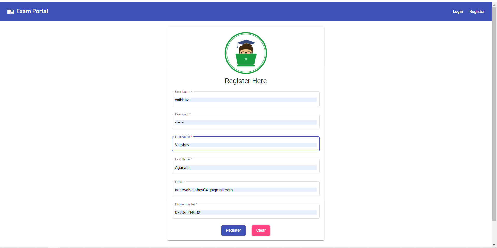

### Login Page
- Users: All who are registered with Exam Dojo
- Users are required to enter a valid:
  - Username
  - Password
  - First Name
  - Last Name
  - Email
  - Phone Number
- All entries are validated and appropriate errors will be given
- Accounts are authenticated using JWT Authentication

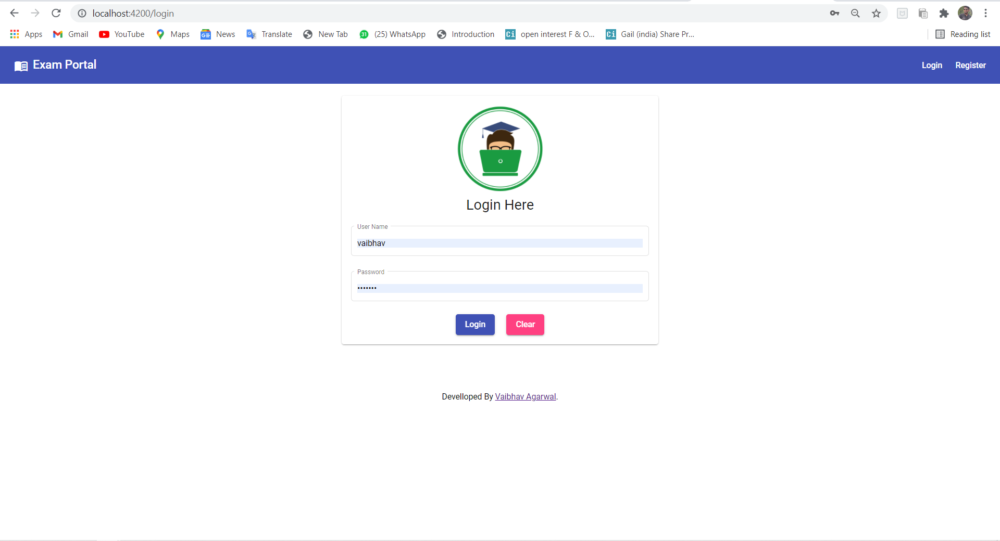

### Welcome Page of Admin-Side
- Users: Professors or anyone who has logged in with an Admin Profile

### Viewing Your Profile Details
- Users: Professors or anyone who has logged in with an Admin Profile
- How to Get Here: Click on the ‘*Profile*’ button from the menu on the left

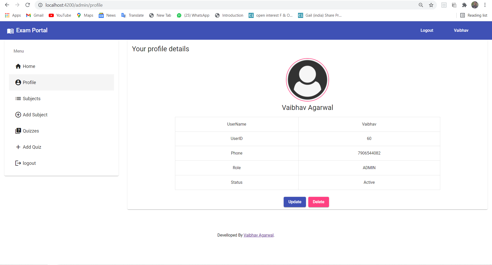

### Adding a Subject
- Users: Professors or anyone who has logged in with an Admin Profile
- How to Get Here: 
  - Click on the ‘*Add Subject*’ button from the menu on the left
  - Click on ‘*Add New Subject*’ below the created subjects within the ‘*Subjects*’ sub-menu
- What you have to enter:
  - Name of the subject
  - Description of the subject

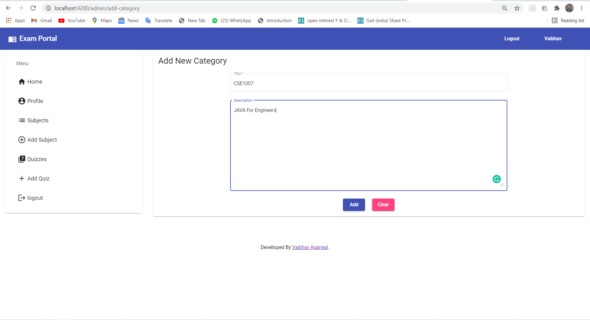

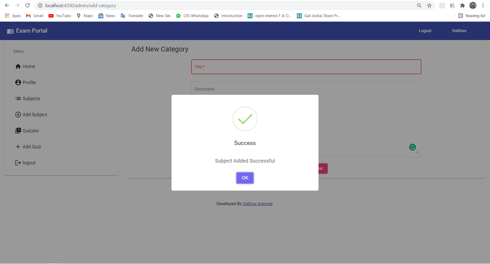

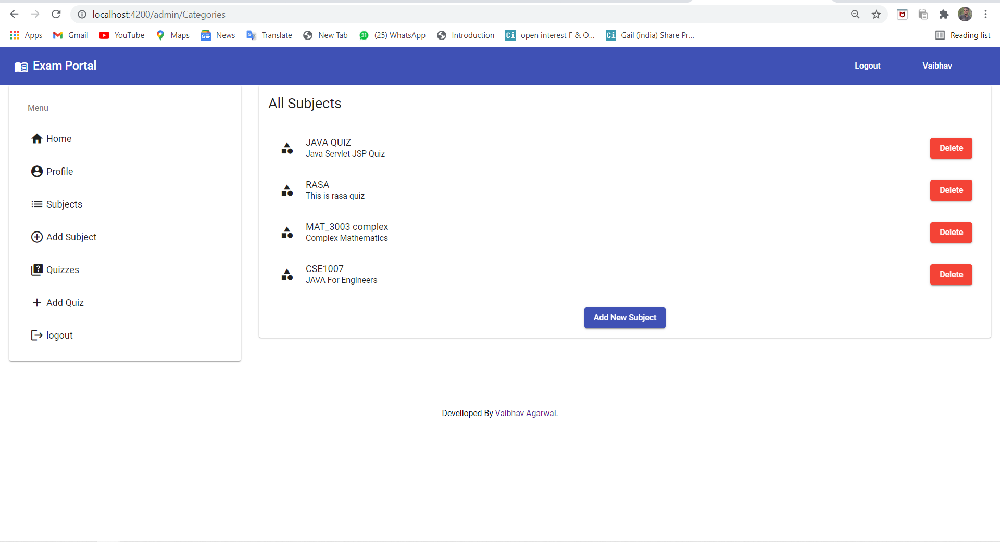

### Viewing Created Subjects
- Users: Professors or anyone who has logged in with an Admin Profile
- How to Get Here: Click on the ‘*Subjects*’ button from the menu on the left

### Deleting a Created Subject
- Users: Professors or anyone who has logged in with an Admin Profile
- How to Get Here: Click on the ‘*Delete*’ button marked in red present on the right of the subject name

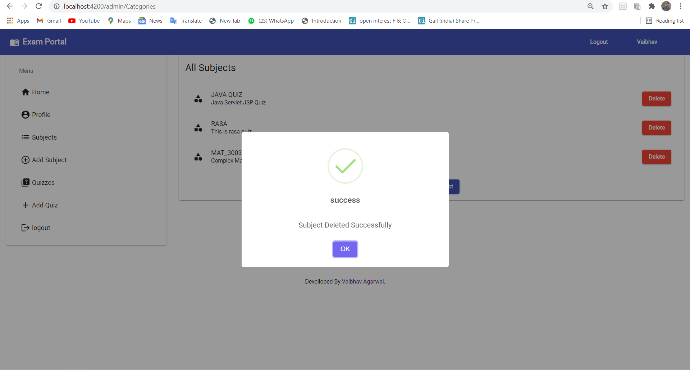

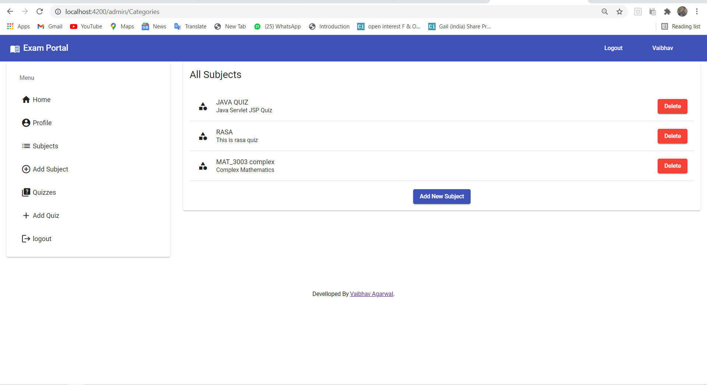

### Adding a Quiz
- Users: Professors or anyone who has logged in with an Admin Profile
- How to Get Here: Click on the ‘*Add Quiz*’ button from the menu on the left
- What you have to enter:
  - Name of the Quiz
  - Description of the Quiz
  - Maximum Marks for the Quiz
  - Number of Questions to be asked
  - Subject that the quiz is part of
  - ‘Publish Status’ toggle will control whether the student is able to view the quiz on their profile

### Adding Questions to a Quiz
- Users: Professors or anyone who has logged in with an Admin Profile
- How to Get Here: Click on the ‘Questions’ button from the row of buttons below the name of a created quiz within the Quizzes Page
- How to Create Your First Question:
  - After clicking on the ‘Questions’ button, click on ‘Add Question’ Button
  - Enter your question in the text field given
    - Questions can be formatted with different font styles, equations, colors, hyperlinks or images with the use of the ribbon of formatting options on the top border of the text filed
  - Enter the four options you would like the student to choose from
  - Select the correct answer from the dropdown list
    - The correct answer must be one of the options
  - Click on ‘*Add*’ button at the bottom of the page
  - You have successfully created a question
  - If you would like to start afresh, you can clear the question and associated option with the ‘*Clear*’ button at the bottom of the page before clicking on the ‘Add’ button
  - Repeat this process to add further questions
- Questions can be updated after adding by clicking on the ‘*Update*’ button within the ‘*Questions*’ *Page*

##

### Viewing Created Quizzes
- Users: Professors or anyone who has logged in with an Admin Profile
- How to Get Here: Click on the ‘*Quizzes*’ button from the menu on the left

### Updating Quiz Information
- Users: Professors or anyone who has logged in with an Admin Profile
- How to Get Here: Click on the ‘*Update*’ button from the row of buttons below the name of a created quiz within the Quizzes Page

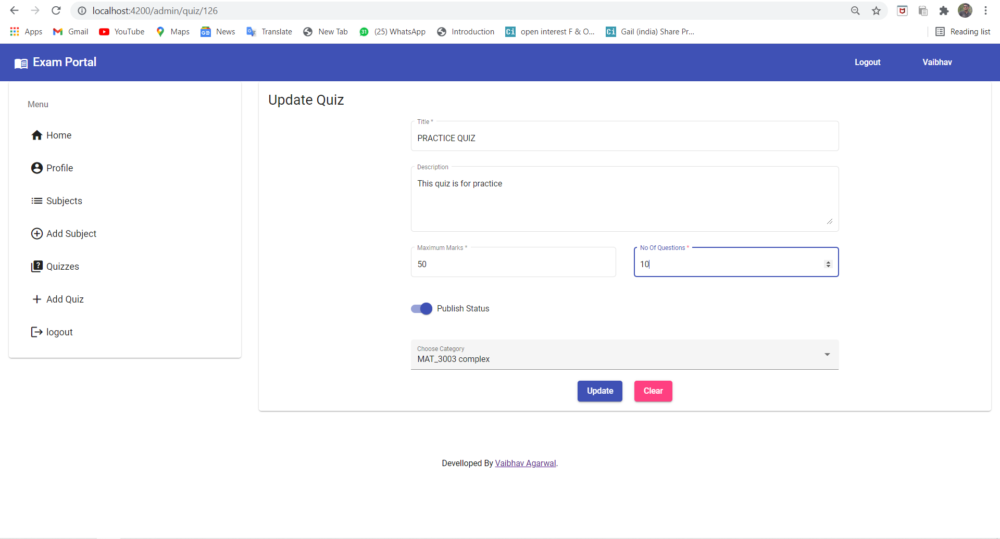

### Viewing the Result for a Quiz as a Professor
- Users: Professors or anyone who has logged in with an Admin Profile
- How to Get Here: From the “Quizzes” page, click on the “*View Result*” button below the name of the quiz you would like to see the results
- The results will be shown student-wise in a tabular manner

## Student Profile

### View All Quizzes
- Users: Students
- How to Get Here: Click on the ‘*All Quizzes*’ button from the menu on the left

### View Quizzes of a Particular Subject
- Users: Students
- How to Get Here: Click on the subject name button from the menu on the left. For example, if you would like to view the quizzes available in the subject, “*MAT\_3003 complex*”, click on the button, “*MAT\_3003 complex*”

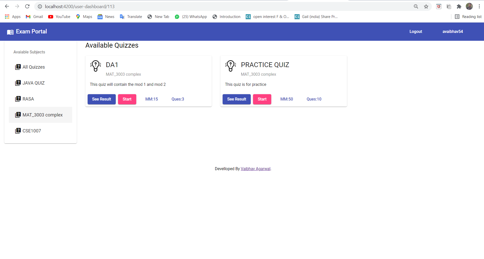

### Starting a Quiz
- Users: Students
- How to Get Here: Click on the “*Start*” button below the quiz name
- Instructions for attempting the quiz will be shown on starting the quiz
- To start answering questions, click on the “*Start Quiz*” button from the instructions page

- A confirmation pop-up will be displayed to start the quiz.
- Click on the “*Start*” button to start. Else, click on the “*No*” button

- It is to be noted that the quiz will Auto Submit when the timer on the right side of the screen reaches 0

- The quiz will auto submit will submit automatically if tab is switched to ensure ethical attempts of the quiz
- On submission, the results of the quiz are shown as a summary

### Viewing the Result for a Quiz
- Users: Students
- How to Get Here: From the “Available Quizzes” page, click on the “*See Results*” button below the name of the quiz you would like to see the results for

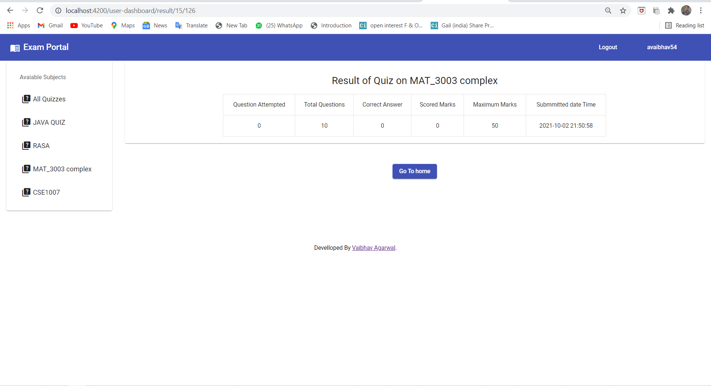
